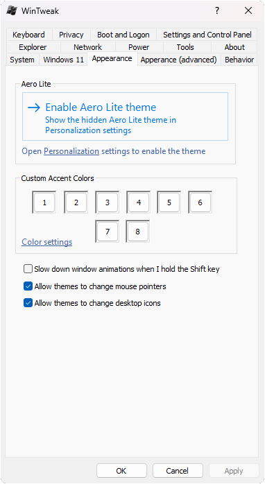

<p align="center">
  
</p>

# <div align="center">WinTweak</div>
WinTweak is an all-in-one program that allows you to tweak various settings in Windows through the registry that aren't visible in any built-in Windows settings panel. **WinTweak** uses a Win32 property sheet for its GUI base, meaning it looks like a native Windows settings panel.

# 🖼️ Screenshot


# ✉️ License
**WinTweak** is licensed under the MIT License. See the [LICENSE](LICENSE) file for more information.

# ⚠️ Beta warning
This project is still in beta, and most tabs are unfinished, their registry tweaks don't apply, and they don't have help information in them, so if you want to configure tweaks in the tabs listed below, wait until they get added, or until v1.0 when all of them will be finished.

Here is a list of the currently unfinished tabs:
- The advanced section of **Behavior** (only the first 3 tweaks currently apply)
- Privacy
- Boot and Logon
- The checkboxes in **Settings and Control Panel** (the hide settings thing works though)
- Explorer
- Network
- Power

The unfinished tabs are 6/14, making up 42.85% of the total tabs.

# 💾 Installation
Go to the [Releases](github.com/fireblade211/wintweak/releases) page, download the executable (**WinTweak_x64.exe** or **WinTweak_x86.exe**), and run it.

# 🔧 Requirements
- Windows 7 or later
- [Microsoft Visual C++ 2015-2022 Redistributable](https://learn.microsoft.com/cpp/windows/latest-supported-vc-redist?view=msvc-140#latest-supported-redistributable-version)

# ⚙️ Registry configuration
**WinTweak** makes changes all over the registry for the actual tweaks, but if you want the actual application configuration, such as the visual styles option and the app backdrop, the program configuration is stored under *HKCU\SOFTWARE\FireBlade\WinTweak* and its subkeys. For your convieniece, you can paste the following commands into the Command Prompt to jump directly to this key:
```cmd
reg add HKCU\Software\Microsoft\Windows\CurrentVersion\Applets\Regedit /v LastKey /d "HKCU\Software\FireBlade\WinTweak" /f
regedit
```
Alternatively, you can also run this from the **Run** dialog (Win+R):
```cmd
cmd /c "reg add HKCU\Software\Microsoft\Windows\CurrentVersion\Applets\Regedit /v LastKey /d HKCU\Software\FireBlade\WinTweak /f && regedit"
```

For now, if you want to know what the values in these keys are named and their proper values you need to look them up in the source code. Either in `main.cpp` where they get loaded (the app entry point) or in `pabout.cpp` where they get put into their respective controls. I may make some documentation later on, but for now you have to do this.
